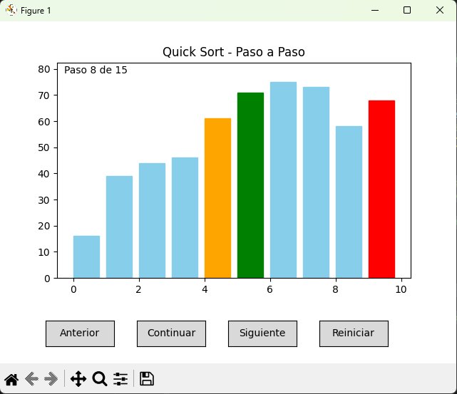

# Ordenamiento utilizando QuickSort

Este es el tipo de ordenamiento con quicksort.

## 📚 Datos de la Materia 

- **Profesor:** Molina Gomez Kevin David  
- **Unidad:** Unidad 5
- **Materia:** Estructura de Datos  
- **Semestre:** 3er Semestre  

## 📚 Datos del Estudiante

- **Nombre:** Gonzalez Flores Victor Daniel  
- **Nombre:** Morales Guillen Hitzel Valeria Nahomi  
- **Nombre:** Vigil Leon Carolina  
- **Nombre:** Prieto Zapata Jorge de Jesus  
---

## 📝 Descripción

Este proyecto implementa el algoritmo QuickSort, un método eficiente de ordenamiento con paradigma divide y vencerás.
Además, se ha incorporado una visualización animada del proceso de ordenamiento para facilitar la comprensión del mismo.
La animación se genera con matplotlib, mostrando paso a paso cómo se ordenan los elementos del arreglo

---

## 🚀 ¿Cómo funciona el codigo?

1. **Primera Etapa del Codigo:**
   
A si es como inicia la visualización de nuestros datos para que sean ordenados utilizando el quicksort

   
   
3. **Segunda Etapa del Codigo:**

Y así es como se pone en ejecución el Metodo de ordenamiento de quicksort, como va buscando….
1.	Elegir un pivote (normalmente el último elemento del subarreglo).
2.	Reordena los elementos: pone a los menores que el pivote a la izquierda y los mayores a la derecha.
3.	Repite recursivamente ese proceso en los subarreglos izquierdo y derecho.
   
   

3. **Resultado Final:**

Pasó final y así es como nuestro arreglo, se encargó de posicionar todos los numeros de número menor al mayor, de izquierda a derecha manteniendo su jerarquía
 
   
   
---

## 📦 Requisitos

- Python 3.7+
- Flask
